# BearPi-HM Micro十分钟上手教程

## 一、准备工作
- 准备一台电脑：
    - 无具体要求，家用即可，Windows系统

## 二、开始下载
- 下载官方提供镜像(任选一种方式下载)
    - Ubuntu20.04（大小8G）下载地址（百度云）：https://pan.baidu.com/s/1W0cgtXC5T2bv0lAya7eizA  提取码：1234
    - Ubuntu18.04（大小4.8G）下载地址（百度云）：https://pan.baidu.com/s/1YIdqlRWRGq_heAfrgQ7EPQ  提取码：1234
    
    **注:** 若已有BearPi-HM Nano开发板的编译环境可以参考[将Nano编译环境升级至Micro编译环境](./Nano编译环境升级至Micro编译环境.md)
- 下载并安装JRE
    - 下载地址（百度云）：https://pan.baidu.com/s/1y6ev83VV7mk7RMigdBDMmw?pwd=1234 提取码：1234

- 下载并安装STM32CubeProgrammer(需要2.4.0+版本)
    - 下载地址（百度云）：https://pan.baidu.com/s/1y6ev83VV7mk7RMigdBDMmw?pwd=1234 提取码：1234

- 下载并安装虚拟机VMware Workstation
    - 下载地址：https://www.vmware.com/cn/products/workstation-pro/workstation-pro-evaluation.html

- 下载并安装MobaXterm工具
    - 下载地址：https://en.softonic.com/download/moba/windows/post-download

- 下载并安装RaiDrive工具
    - 下载地址：https://forspeed.rbread05.cn/down/newdown/5/28/RaiDrive.rar   
- 下载并安装开发板USB驱动
    - 下载地址：http://www.wch.cn/downloads/CH341SER_EXE.html
- 下载并安装VS Code
    - 下载地址：https://code.visualstudio.com
## 三、开始部署环境

1. 解压百度云下载的HarmonyOS`BearPi-HM Micro Ubuntu.zip`文件到某个目录。

    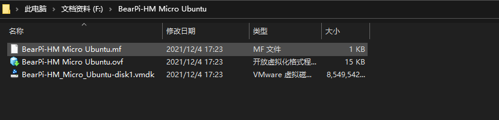

2. 打开VMware Workstation工具

    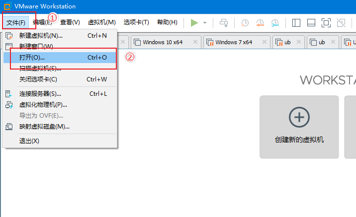

3. 选择第1步解压的`BearPi-HM Micro Ubuntu`文件夹中，点击` 打开 `

    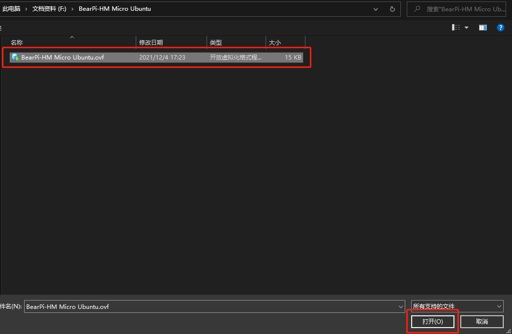

4. 导入镜像到本地磁盘（选择一个磁盘空间大小≥ 10G的盘），点击`导入`。

    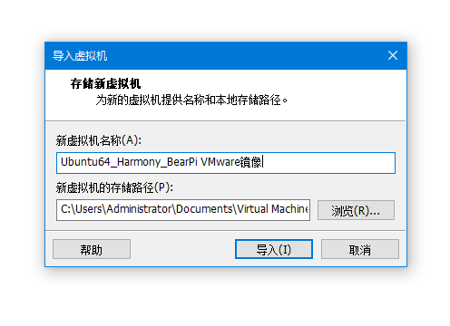

5. 点击`开启此虚拟机`，来开启虚拟机电源

    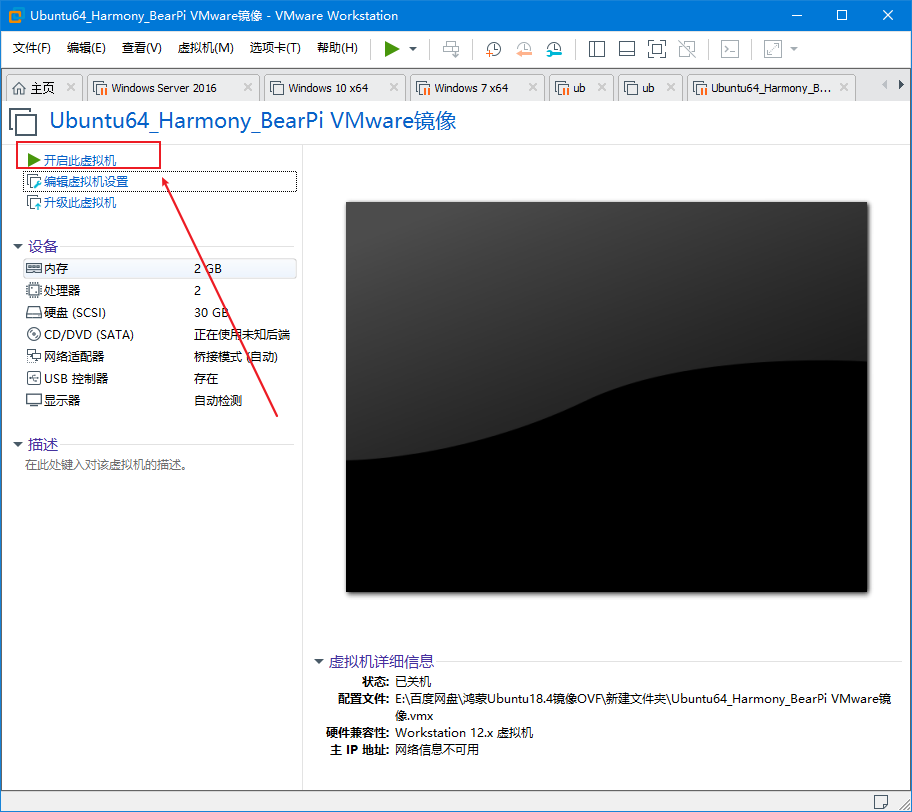
    
6. 此时虚拟机进入登录界面，点击`BearPi-HM Micro Ubuntu`

    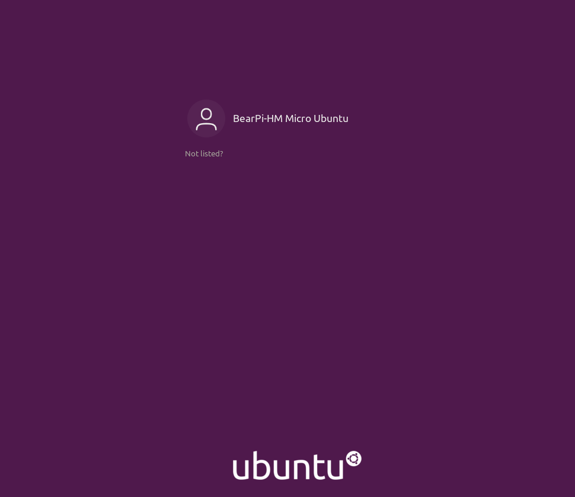

7. 输入密码：bearpi，然后点击`登录`

    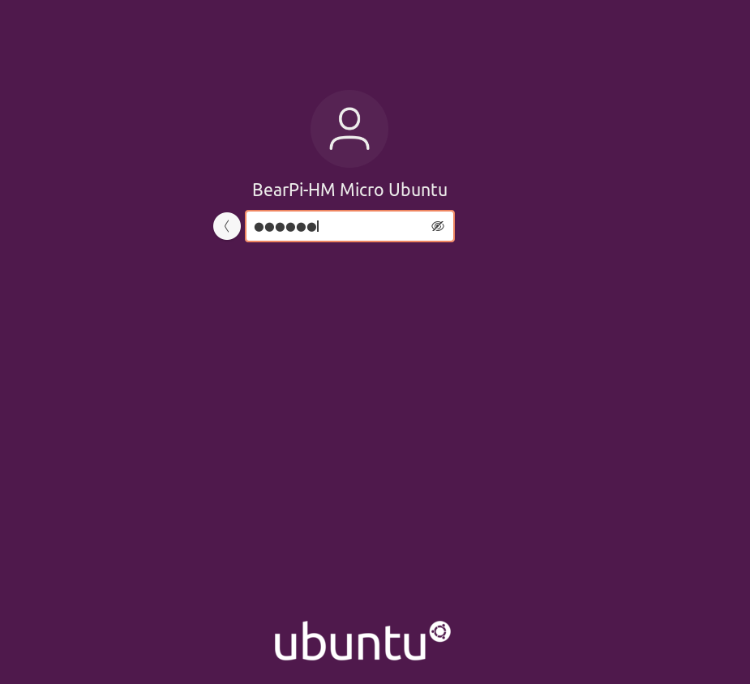

8. 进入桌面后，点击桌面空白处`右键`，点击`打开终端(E)`

    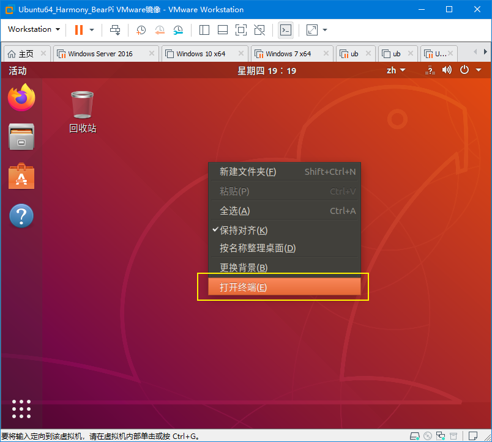

9. 在终端中输入`ifconfig`，然后点击回车，除`lo`外，另外一个就是你的网卡信息，记录你获取到的IP地址。

    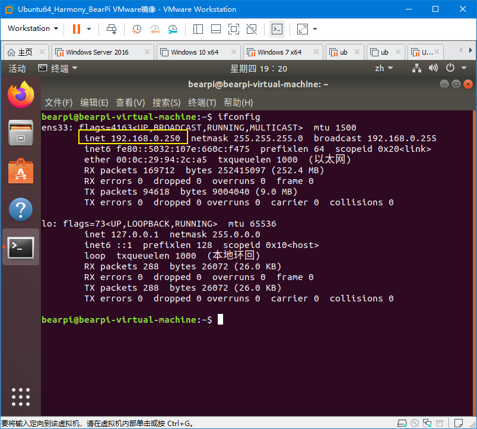

10. 最小化VMware Workstation，回到Windows桌面上。

11. 附加：如果连不上网络（如果主机网络需要拨号，如`校园网络`、`ADSL拨号`等）

    在VMware Workstation中，点击`虚拟机`>> `设置`

    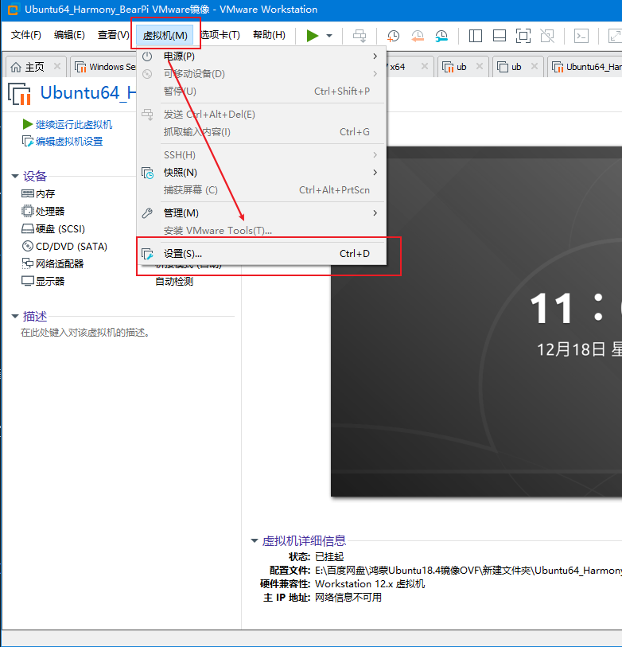

    然后在网络适配器中，改成`NAT 模式`，点击`确定`

    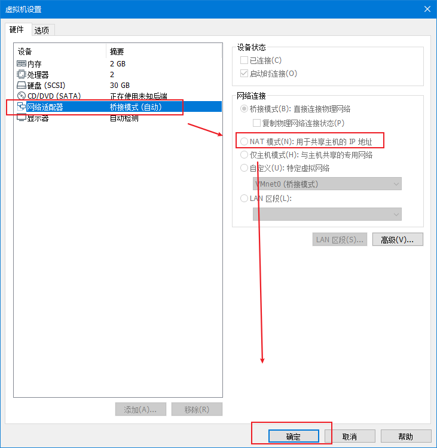

    然后再回复`步骤8`。
    

## 四、在Windows上远程连接服务器

1. 打开`MobaXterm`工具，并依次点击：`Session`，`SSH` 按钮。

    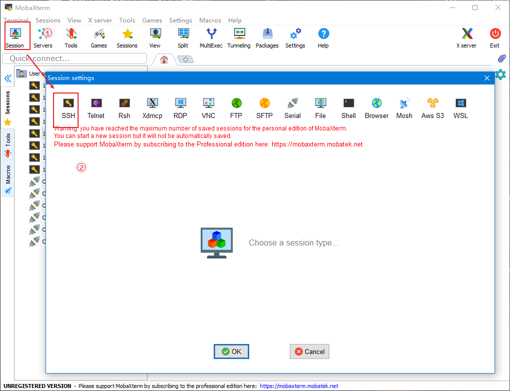

2. 输入连接信息，远程地址，并点击OK

    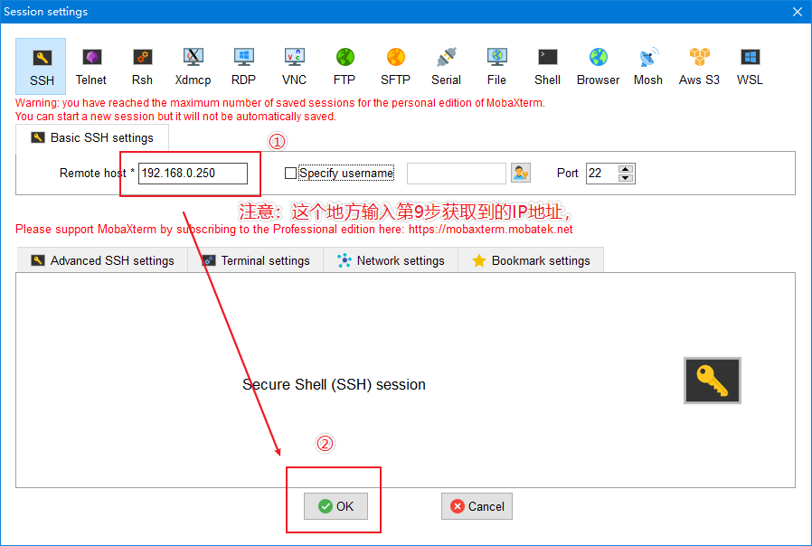

3. 输入账号：`bearpi`，点击回车

    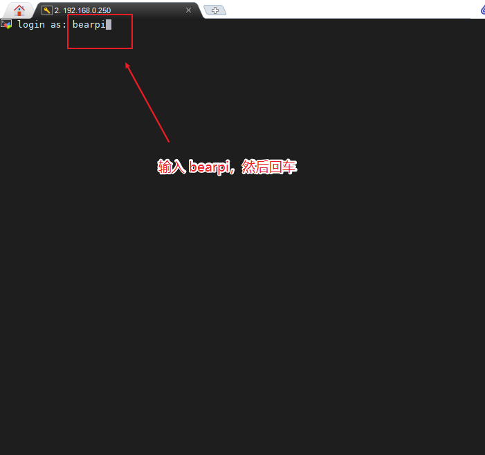

4. 输入密码：`bearpi`，注意，输入密码的时候屏幕不会显示，输完之后点击`回车`

    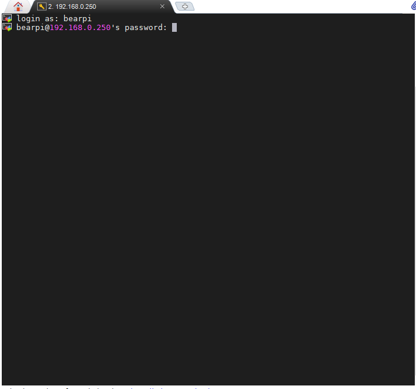

5. 在弹出的界面上，点击`Yes`保存账号信息，以免下次输入

    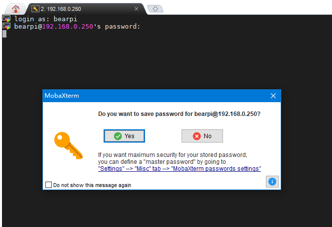

## 五、把ubuntu文件远程映射到Windows上

1. 安装RaiDrive软件
   
    默认安装即可。

2. 切换为中文语言

    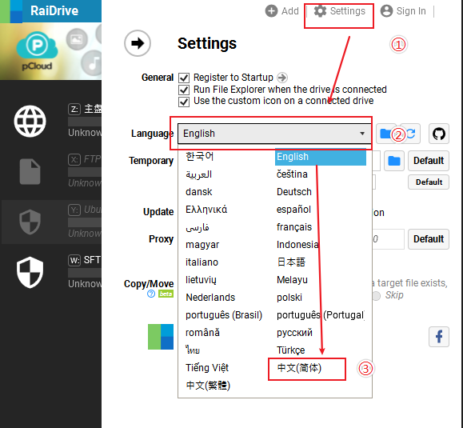

3. 添加链接信息

    * 取消勾选只读
    * SFTP://______ （这个输入 三.9 获取到的地址）
    * 账户：账号和密码皆为 bearpi   
    * 其他默认
    * 点击`确定`

    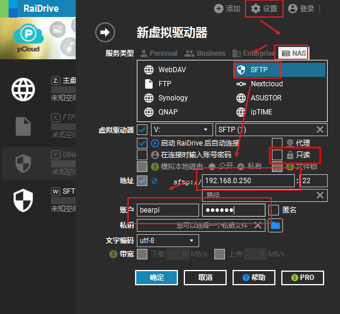

4. 查看本地映射的ubuntu文件路径

    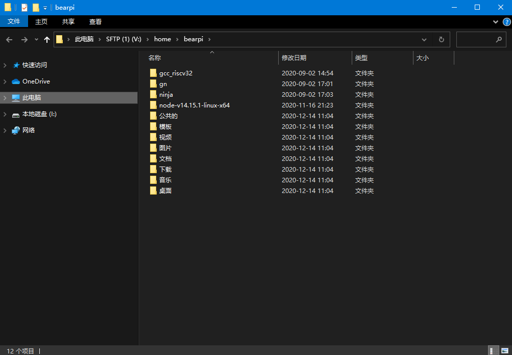


## 六、在ubuntu获取源码

1. 鼠标焦点移到MobaXterm

2. 在MobaXterm中输入：
    ```
    cd /home/bearpi
    ```
    然后回车

3. 在MobaXterm中输入： 
    ```
    mkdir project && cd project
    ```
    然后回车

4. 在MobaXterm中输入以下命令获取源码：
    ```
    git clone https://gitee.com/bearpi/bearpi-hm_micro_small.git
    ```

    然后回车，等待1-3分钟（根据不同网速）

    **注：** 若执行失败请参考`第三-11`解决网络问题，并通过ping外网确认ubuntu网络正常。


## 七、编译代码

1. 在MobaXterm中输入以下指令，进入源码根目录
    ```
    cd /home/bearpi/project/bearpi-hm_micro_small/
    ```
2. 在MobaXterm中输入:
    ```
    hb set 
    ```
    再输入"."(点)
    ``` 
    .
    ```
    选择“bearpi-hm_micro”，然后回车

    

3. 在MobaXterm中输入：
    ```
    hb build -t notest --tee -f
    ```
    然后回车，等待直到屏幕出现：`build success`字样，说明编译成功。

4. 查看编译出的固件位置

    当编译完后，在Windows中可以直接查看到最终编译的固件，具体路径在：
    `\project\bearpi-hm_micro_small\out\bearpi_hm_micro\bearpi_hm_micro`
    其中有以下文件是后面烧录系统需要使用的。
    
    * OHOS_Image.stm32：系统镜像文件
    * rootfs_vfat.img：根文件系统
    * userfs_vfat.img：用户文件系统


    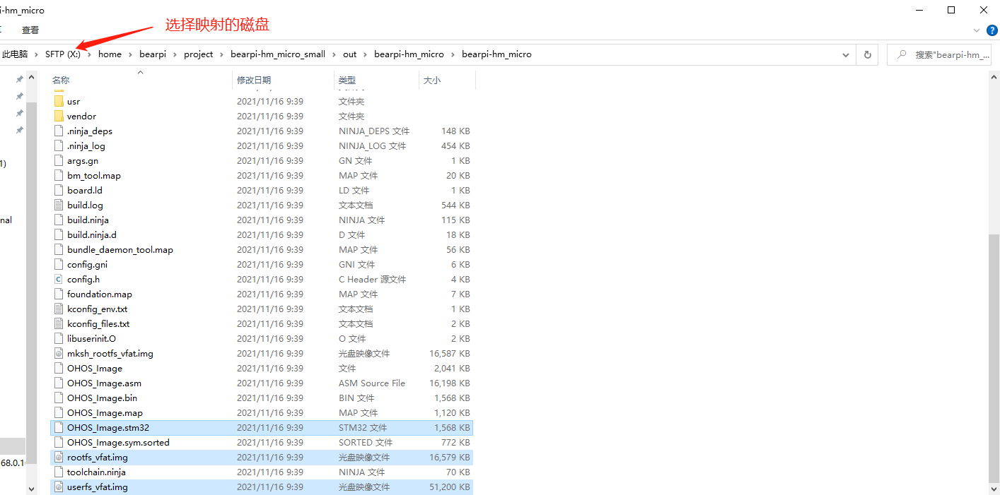


    *注意，最前的磁盘在为`RaiDrive`映射的路径。
5. 在MobaXterm中执行以下三条指令将以上三个文件复制到`applications/BearPi/BearPi-HM_Micro/tools/download_img/kernel/`下，以便后续烧录系统使用

    ```
    cp out/bearpi_hm_micro/bearpi_hm_micro/OHOS_Image.stm32 applications/BearPi/BearPi-HM_Micro/tools/download_img/kernel/
    cp out/bearpi_hm_micro/bearpi_hm_micro/rootfs_vfat.img applications/BearPi/BearPi-HM_Micro/tools/download_img/kernel/
    cp out/bearpi_hm_micro/bearpi_hm_micro/userfs_vfat.img applications/BearPi/BearPi-HM_Micro/tools/download_img/kernel/
    ```
    


## 八、连接开发板

1. 通过TypeC数据线，把电脑与BearPi-HM Micro连接。

2. 安装CH340驱动。

    下载地址：http://www.wch.cn/downloads/CH341SER_EXE.html

3. 关闭虚拟机捕获USB功能。（有很多开发者都是因为虚拟机捕获了USB设备，导致本机Windows电脑看不到串口）

    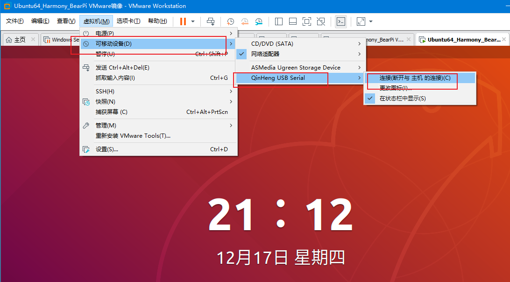

    如果上面操作不行，直接关闭VMware Workstation，选择挂起，然后再重新插拔USB。

4. 查看开发板的串口

    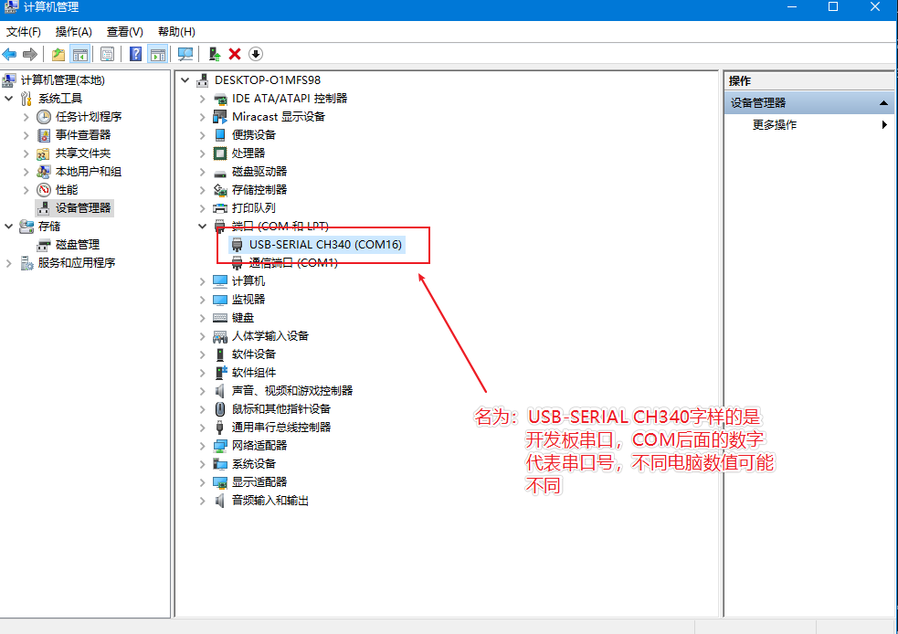

## 九、烧录镜像

1. 将开发板的拨码开关上拨到“000”烧录模式，并按一下开发板的RESET按键

    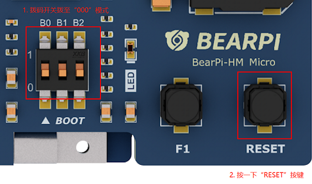

2. 在Windows打开STM32CubeProgrammer工具，选择“USB”烧录方式，再点击刷新按钮，然后点击"Connect"。

    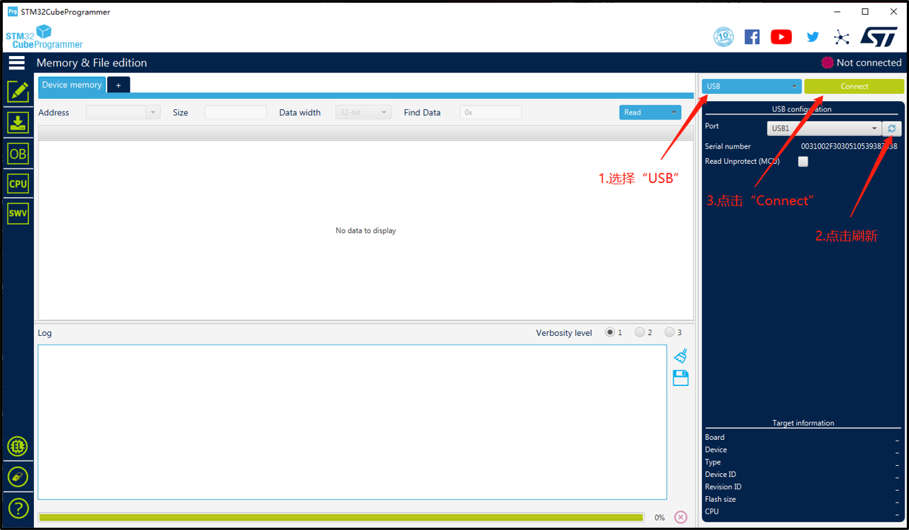

3. 点击STM32CubeProgrammer工具的“+”按钮，然后选择烧录配置的tvs文件。
    
    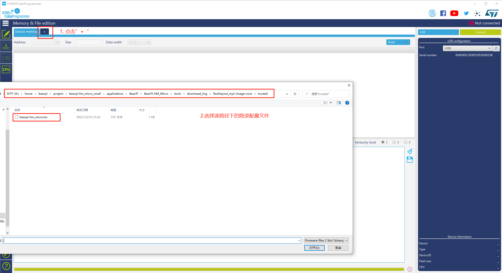

4. 点击Browse按钮，然后选择工程源码下的烧录镜像路径

    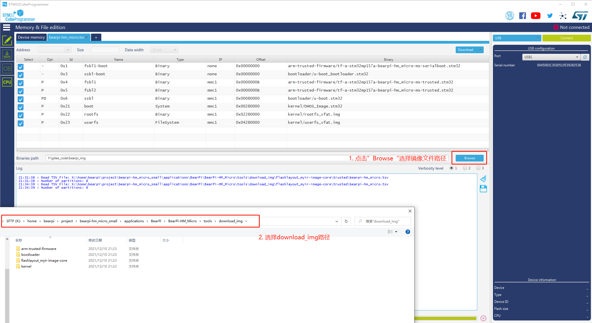
    
5. 点击Download按钮启动镜像烧录，并等待烧录完毕。

    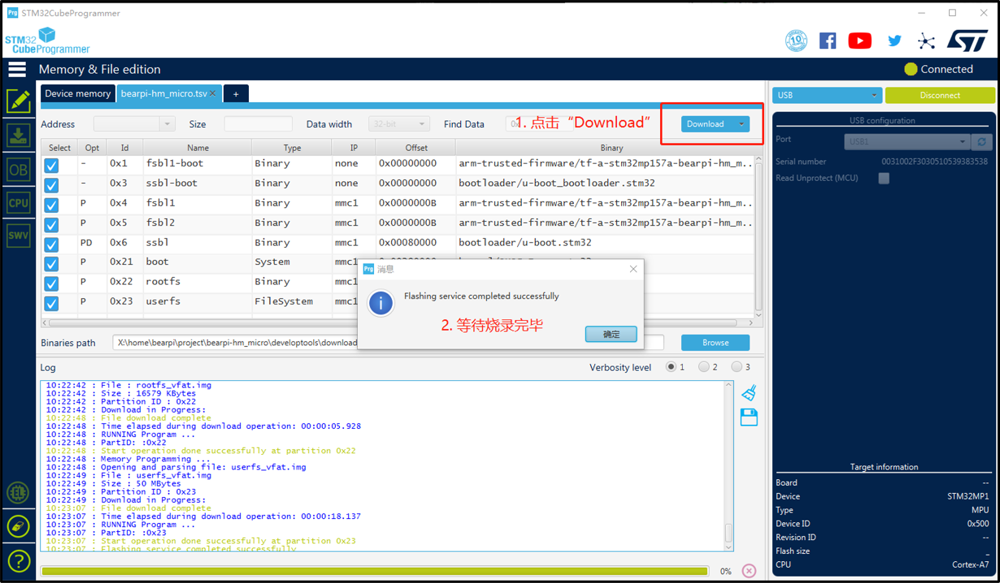

## 十、启动开发板进入终端

1. 打开MobaXterm，
   
    1. 点击：`Session`、`Serial`按钮

    2. 设置Seral port为 第八-4 查看到的COM号

    3. 设置Speed为 `115200`

    4. 点击`OK`


    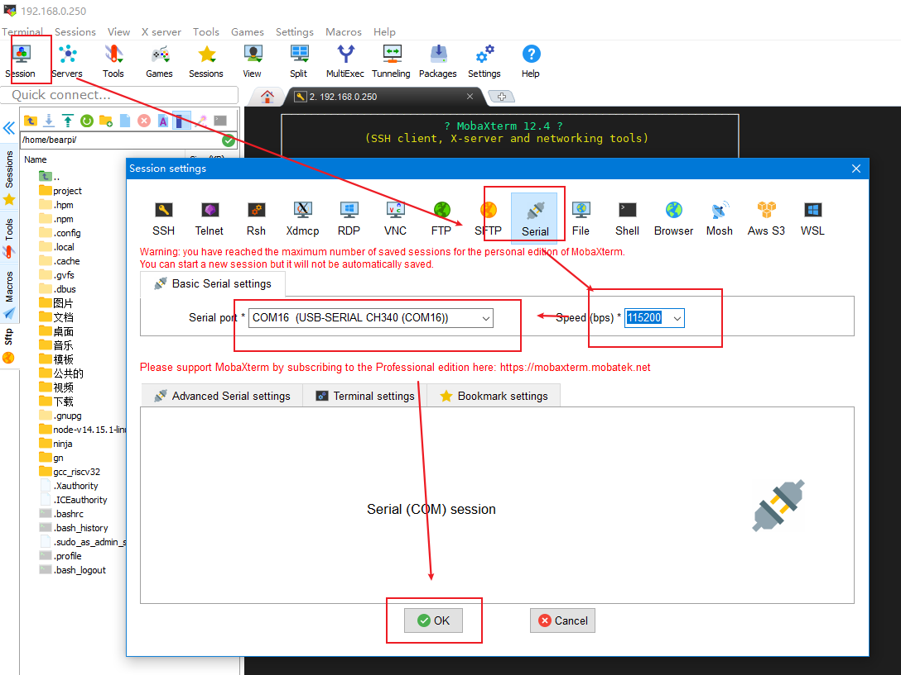


3. 将开发板的拨码开关拨至“010”emmc启动模式，并按一下开发板的“RESET”按钮复位开发板。

    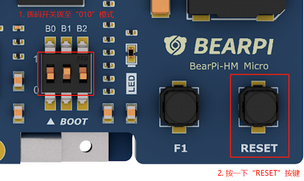

4. MobaXterm上打印出运行日志，等待启动日志运行结束，按键盘“回车”按键进入开发板shell终端，输入例如"ls"命令，可与开发板交互。

    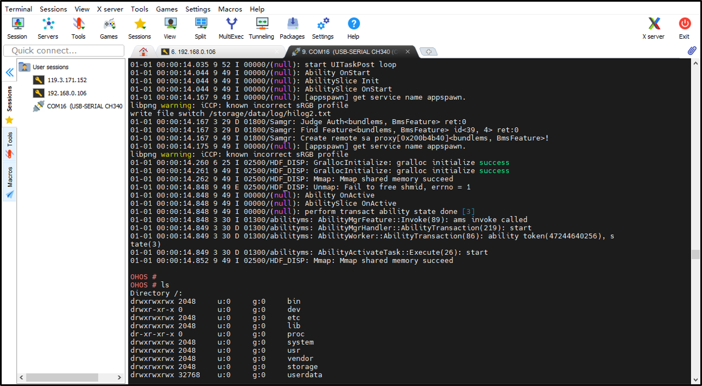

5. 开发板屏幕出现桌面及预安装的"setting"应用，点击"setting"应用可查看系统信息。

    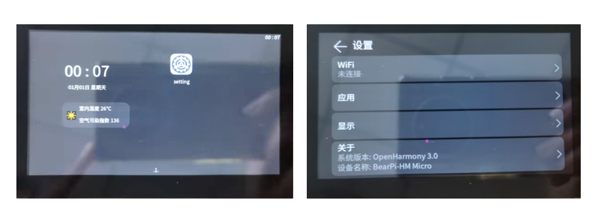


