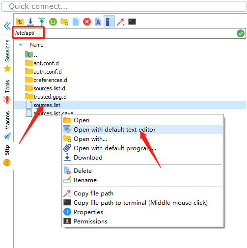
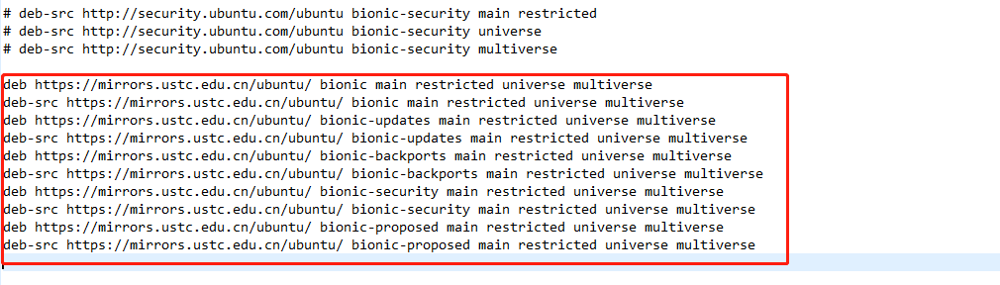
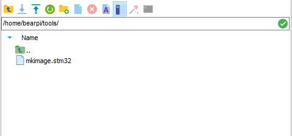

# BearPi-HM Nano编译环境升级至BearPi-HM Micro编译环境

以下教程旨在指导之前已经成功搭建BearPi-HM Nano编译环境的用户如何升级至BearPi-HM Micro编译环境。

## 一、修改镜像源

1. 打开/etc/apt路径下的sources.list文件

    

2. 将原本的镜像源改为中科大镜像源,然后关闭文件并保存

    

    ```
    deb https://mirrors.ustc.edu.cn/ubuntu/ bionic main restricted universe multiverse
    deb-src https://mirrors.ustc.edu.cn/ubuntu/ bionic main restricted universe multiverse
    deb https://mirrors.ustc.edu.cn/ubuntu/ bionic-updates main restricted universe multiverse
    deb-src https://mirrors.ustc.edu.cn/ubuntu/ bionic-updates main restricted universe multiverse
    deb https://mirrors.ustc.edu.cn/ubuntu/ bionic-backports main restricted universe multiverse
    deb-src https://mirrors.ustc.edu.cn/ubuntu/ bionic-backports main restricted universe multiverse
    deb https://mirrors.ustc.edu.cn/ubuntu/ bionic-security main restricted universe multiverse
    deb-src https://mirrors.ustc.edu.cn/ubuntu/ bionic-security main restricted universe multiverse
    deb https://mirrors.ustc.edu.cn/ubuntu/ bionic-proposed main restricted universe multiverse
    deb-src https://mirrors.ustc.edu.cn/ubuntu/ bionic-proposed main restricted universe multiverse
    ```

3. 更新镜像源

    ```
    sudo apt-get update
    ```
## 二、安装必要的库和工具
- 使用如下apt-get命令安装编译所需的必要的库和工具：

    ```
    sudo apt-get install build-essential gcc g++ make zlib* libffi-dev e2fsprogs pkg-config flex bison perl bc openssl libssl-dev libelf-dev libc6-dev-amd64 binutils binutils-dev libdwarf-dev u-boot-tools mtd-utils gcc-arm-linux-gnueabi cpio device-tree-compiler net-tools openssh-server git vim openjdk-11-jre-headless
    ```

## 四、安装hb

1.  运行如下命令安装hb

    ```
    python3 -m pip install --user ohos-build
    ```

2.  设置环境变量

    ```
    vim ~/.bashrc
    ```

    将以下命令拷贝到.bashrc文件的最后一行，保存并退出。

    ```
    export PATH=~/.local/bin:$PATH
    ```

    执行如下命令更新环境变量。

    ```
    source ~/.bashrc
    ```
3.  执行"hb -h"，有打印以下信息即表示安装成功：

    ```
    usage: hb
    
    OHOS build system
    
    positional arguments:
      {build,set,env,clean}
        build               Build source code
        set                 OHOS build settings
        env                 Show OHOS build env
        clean               Clean output
    
    optional arguments:
      -h, --help            show this help message and exit
    ```


## 六、安装mkimage工具
1. 新建tools目录

    ```
    mkdir ~/tools 
   ```
2. 下载mkimage.stm32工具，并复制到/home/bearpi/tools/目录下

    mkimage.stm32下载地址:  https://pan.baidu.com/s/1y6ev83VV7mk7RMigdBDMmw?pwd=1234 提取码：1234

    

3. 执行以下命令修改mkimage.stm32工具权限

    ```
    chmod 777 ~/tools/mkimage.stm32
    ```

4. 设置环境变量
    
    ```
    vim ~/.bashrc
    ```

    将以下命令拷贝到.bashrc文件的最后一行，保存并退出。

    ```
    export PATH=~/tools:$PATH
    ```

    执行如下命令更新环境变量。

    ```
    source ~/.bashrc
    ```


