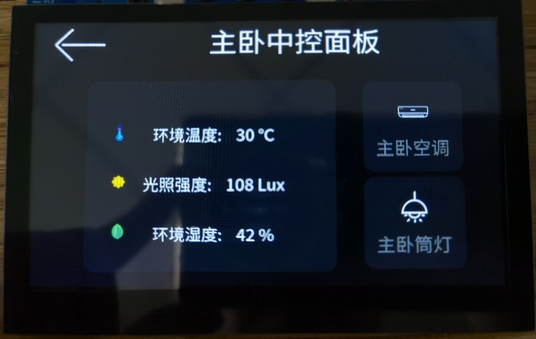
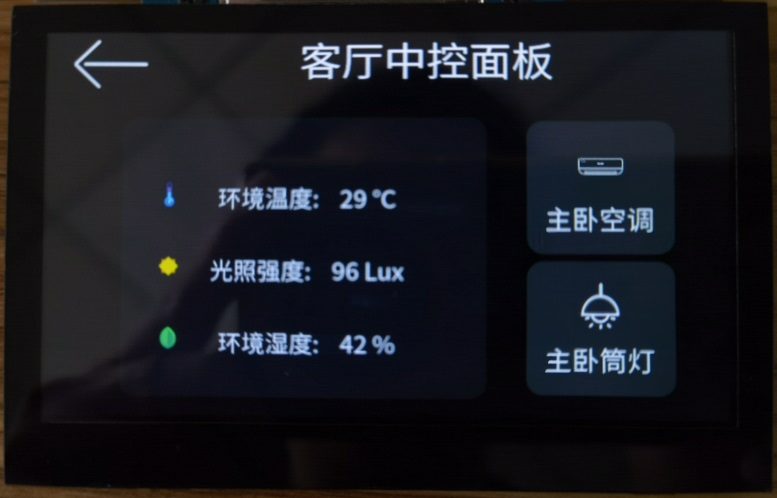

# 基于UDP的中控面板开发指导

## 硬件准备

1. [BearPi-HM Micro开发板](https://item.taobao.com/item.htm?id=662078665554) * 2
2. [E53_IA1扩展板](https://item.taobao.com/item.htm?id=607878490044) * 1


## 1、编译生成主卧中控面板demo_cenctrl_client.hap文件

1. 编译产品
    ```
    hb set 
    ```
    再输入"."(点)
    ``` 
    .
    ```
    选择“demo_cenctrl_client”，然后回车
    ```
    hb build -t notest --tee -f
    ```
    然后回车，等待直到屏幕出现：`build success`字样，说明编译成功。
2. 打包hap

    将编译生成的libcenctrl.so文件复制到demo_cenctrl目录下
    ```
    cp out/bearpi_hm_micro/demo_cenctrl_client/usr/lib/libcenctrl.so vendor/bearpi/demo_cenctrl_client/demo_cenctrl
    ```

    将 res、libcenctrl.so、config.json压缩成demo_cenctrl_client.zip文件，然后再将后缀改为.hap

## 2、编译生成客厅中控面板demo_cenctrl_server.hap文件

1. 编译产品
    ```
    hb set 
    ```
    再输入"."(点)
    ``` 
    .
    ```
    选择“demo_cenctrl_server”，然后回车
    ```
    hb build -t notest --tee -f
    ```
    然后回车，等待直到屏幕出现：`build success`字样，说明编译成功。
2. 打包hap

    将编译生成的libcenctrl.so文件复制到demo_cenctrl目录下
    ```
    cp out/bearpi_hm_micro/demo_cenctrl_server/usr/lib/libcenctrl.so vendor/bearpi/demo_cenctrl_server/demo_cenctrl
    ```

    将 res、libcenctrl.so、config.json压缩成demo_cenctrl_server.zip文件，然后再将后缀改为.hap


## 3、安装HAP应用

分别在两套设备上安装demo_cenctrl_client.hap和demo_cenctrl_server.hap
1. 输入以下命令，打开调试模式
    ```
    ./bm set -s disable
    ./bm set -d enable
    ```
    
2.	安装应用
    ```
    ./bm install -p xxx.hap
    ```
## 4、连接Wi-Fi

以下是使用可执行文件连接Wi-Fi，该方式比较稳定，开发者也可在setting应用里面去连接Wi-Fi。

1.修改samples/communication/wpa_supplicant/config/wpa_supplicant.conf中的ssid和psk信息。

```
country=GB
ctrl_interface=udp
network={
    ssid="bearpi"
    psk="0987654321"
}
```
重新编译系统并烧录。

2.执行以下命令连接Wi-Fi
```
./bin/wpa_supplicant -i wlan0 -d -c /etc/wpa_supplicant.conf
```
**注： 两套设备需要连接到同一个Wi-Fi，使其在同一个局域网中。**

## 5、应用调测

1.在主卧中控面板上安装E53_IA1扩展板，并打开主卧中控面板应用，可查看主卧的温度、湿度、光照强度。



2.打开客厅面板应用，可在客厅中控面板上控制主卧的空调和筒灯。

