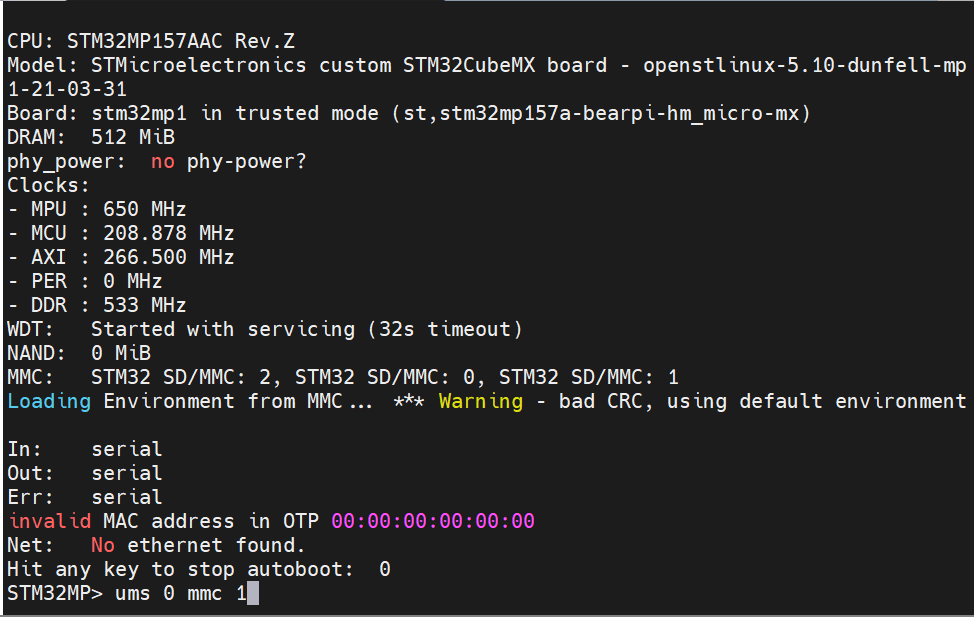
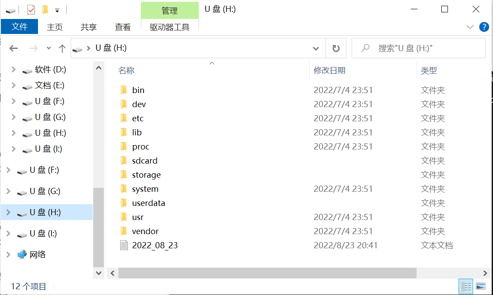

# 如何在开发板上安装HAP应用

以下以安装一个控制灯开关的应用为例讲解如何在开发板上安装HAP应用.

## 一、准备工作

- 准备一张TF卡（需要格式化为FAT32），以及一个读卡器
- 如果没有TF卡，以下也有另一种复制文件的方法。


## 二、挂载TF卡
1. 将applications/BearPi/BearPi-HM_Micro/tools/hap_tools/hap_example路径下的bm、LED_1.0.0.hap拷贝到SD卡中

2. 将SD卡插入到开发板中，并按开发板的RESET按键重启开发板

3. 输入以下命令，挂载SD卡
	```
    mount /dev/mmcblk0p0 /sdcard vfat
    ```
4. 输入以下命令，进入SD卡目录
	```
    cd /sdcard
    ```

## 三、无TF卡复制文件（可选）

1. 按下开发板的RESET按钮重启开发板

2. 在命令行看到提示“Hit any key to stop autoboot”时，按下回车按钮。可以看到输入命令提示。此时开发板停留在uboot阶段，尚未进入系统。

    

3. 输入命令
    ```
    ums 0 mmc 1
    ```

4. 此时电脑上会挂载很多个u盘。逐个尝试浏览每一个u盘，如果遇到提示格式化的就略过，不要格式化。直到看到一个u盘内的文件夹目录如图所示。（2022_08_23.txt为测试用文件）

    

5. 将applications/BearPi/BearPi-HM_Micro/tools/hap_tools/hap_example路径下的bm、LED_1.0.0.hap拷贝到根目录。

6. 重启开发板，无视uboot提示，正常进入系统。

## 四、安装HAP应用

1. cd进入之前拷贝文件的路径。输入以下命令，打开调试模式
    ```
    ./bm set -s disable
    ./bm set -d enable
    ```
    
2.	安装应用
    ```
    ./bm install -p LED_1.0.0.hap
    ```

注: LED_1.0.0.hap为安装包名称，安装其他应用需要修改为对应的安装包名称。
