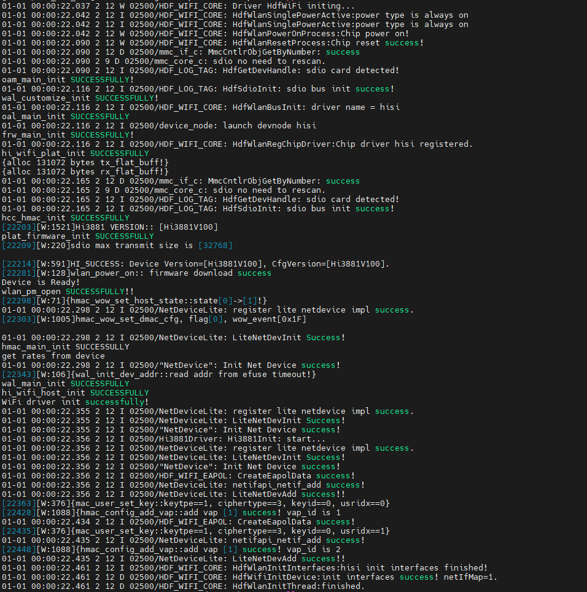

# 开发板Wi-Fi功能使用指导

## 一、准备工作

- [编译](如何编译系统.md)、[烧录](如何烧录固件并启动.md)最新代码。
- 准备一个 2.4G 的 Wi-Fi 热点，Wi-Fi 热点的密码需为纯数字。
## 二、连接Wi-Fi
### 1、使用桌面setting应用连接Wi-Fi

1. 系统启动后会需要等一段时间才会加载wifi，若看到以下片段日志，说明wifi已经加载好后，然后再用setting应用去联网。


**注: 官方给的setting应用联网后退出wifi会断开，而且有概率会导致系统跑崩。**
### 2、使用可执行文件连接Wi-Fi

1.修改samples/communication/wpa_supplicant/config/wpa_supplicant.conf中的ssid和psk信息。

```
country=GB
ctrl_interface=udp
network={
    ssid="bearpi"
    psk="0987654321"
}
```
2.执行以下命令连接Wi-Fi
```
./bin/wpa_supplicant -i wlan0 -d -c /etc/wpa_supplicant.conf
```
